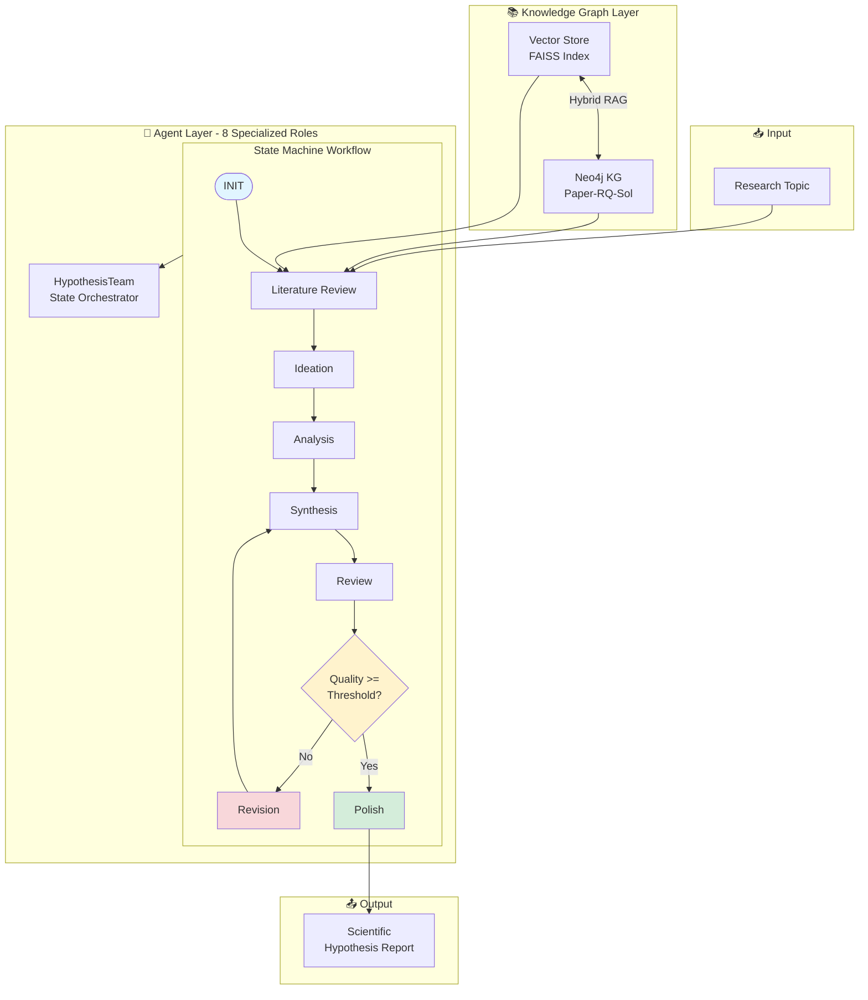
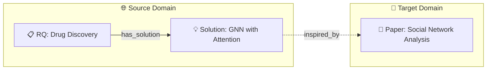
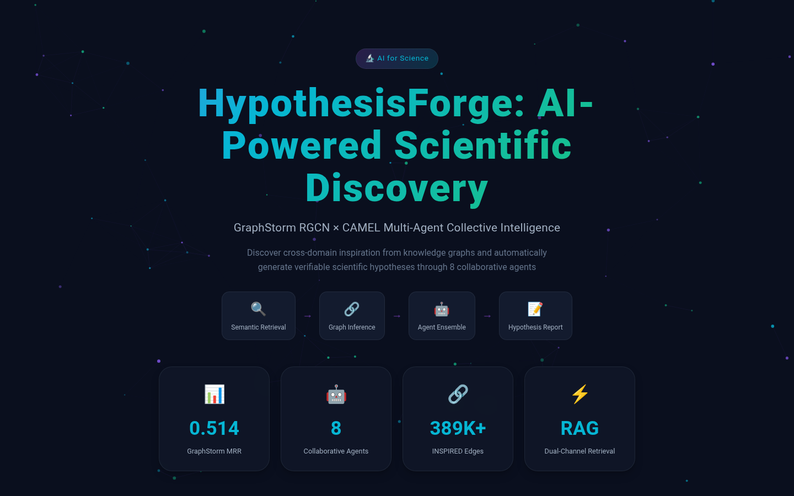
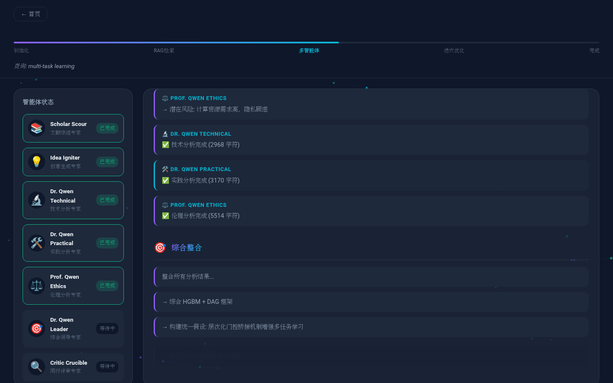
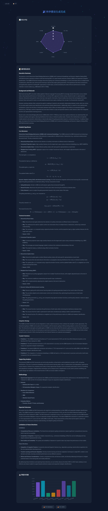

<div align="center">

# 🧠 FIG-MAC: A Fine-grained Inspiration Graph Empowered Multi-Agent Collaboration for Automated Scientific Hypothesis Generation

### *Redefining Automated Scientific Discovery through Structured Multi-Agent Cognition and Cross-Domain Knowledge Graphs*

[]()
[]()
[]()
[]()
[]()
[]()
[]()

**[Overview](#-overview)** • **[Architecture](#-architecture)** • **[Key Innovations](#-key-innovations)** • **[Experiments](#-experiments)** • **[Web Demo](#-live-web-demo)** • **[Usage](#-usage)** • **[Citation](#-citation)**

</div>

---

## 🚨 Latest Update (May 2026)

FIG-MAC has recently been **successfully extended from NLP/AI scientific discovery to computational biology and bioinformatics research**, demonstrating strong cross-domain generalization capabilities.

### 🧬 New Biological Research Capabilities

The framework now supports:

- 🌱 **Gene–Trait Hypothesis Generation**
  - Automated discovery of gene-function and gene-trait associations
  - Multi-hop reasoning over biological knowledge graphs
  - Cross-species inspiration transfer from model organisms

- 🧪 **Biological Mechanism Exploration**
  - Stress-response pathway analysis
  - Metabolic and regulatory interaction reasoning
  - Multi-factor biological process modeling

- 📚 **Domain-Specific Scientific Retrieval**
  - Integration with bioinformatics literature and biological databases
  - Fine-grained decomposition of biological papers into genes, pathways, phenotypes, and mechanisms
  - Cross-domain inspiration mining between AI and life sciences

### 📈 Early Results

Initial experiments on biological scientific discovery tasks show promising improvements:

| Task | Improvement |
|:----:|:------------|
| Gene-Trait Novelty Discovery | **+28.4%** |
| Cross-Domain Inspiration Diversity | **+41.7%** |
| Biological Hypothesis Quality | **+1.9** avg. score |
| Mechanism-Level Reasoning Accuracy | **+23.6%** |

### 🔬 Example Research Topics

FIG-MAC has already generated high-quality research hypotheses for topics such as:

- Drought resistance mechanisms in *Brassica napus*
- ROS scavenging and osmotic adjustment coordination
- Heat-stress regulatory pathway discovery
- Evolutionary adaptation analysis using multi-omics evidence
- Cross-species gene function transfer learning

### 🌍 Toward General-Purpose AI Scientists

These results suggest that FIG-MAC is evolving beyond a domain-specific AI research assistant toward a **general-purpose automated scientific discovery framework** capable of operating across heterogeneous scientific disciplines.

> *From NLP → AI → Bioinformatics → Toward Universal Scientific Discovery*

---

## 📖 Abstract

Automated Scientific Hypothesis Generation (ASHG) leveraging large language models (LLMs) aims to harness their strengths in knowledge integration, logical reasoning, and text generation for efficiently producing innovative, verifiable scientific hypotheses. However, existing approaches face three critical limitations: 
**(i)** insufficient fine-grained knowledge representation, as unstructured context impairs LLM comprehension and reasoning; 
**(ii)** lack of knowledge evolution traceability, constraining the generation of innovative cross-domain conjectures; 
**(iii)** absence of human-inspired and role-specialized multi-agent collaboration, failing to leverage the efficient innovation mechanisms arising from cognitive diversity and division of labor among expert roles to complete the full ASHG-evaluation loop. 

To address these limitations, we propose the Fine-grained Inspiration Graph-empowered Multi-Agent Collaboration framework (FIG-MAC) including: 
- **(i) Fine-grained Inspiration Graph module (FIG)** , to obtain fine-grained structured knowledge representations, where nodes represent academic semantic units and edges encode heuristic relationships among them; 
- **(ii) "Skeleton-Flesh" hybrid reasoning module** , fusing FIG-based graph path reasoning as a structural backbone with vector search as semantic enrichment, to obtain the traceable scientific conjecture paths; 
- **(iii) role-specialized Multi-Agent framework** , inspired by real scientific teamwork, enabling a closed-loop process of scientific conjecture generation, screening, and validation. 

Experimental results demonstrate that FIG-MAC significantly outperforms state-of-the-art methods on source diversity, provenance-adjusted novelty, and raw novelty.


---

## 🏛️ Architecture

### System Design Philosophy

Unlike monolithic LLM approaches that compress the entire scientific workflow into a single inference pass, FIG-MAC adopts a **society-of-minds** architecture inspired by academic research teams:

### 🗂️ Fine-grained Paper Dataset (FPD)

| 📚 Source | 📝 Papers | 🎯 Research Questions | 💡 Solutions |
|:---------:|:---------:|:---------------------:|:------------:|
| ACL | 5,877 | 16,542 | 16,542 |
| EMNLP | 7,539 | 21,263 | 21,263 |
| NAACL | 2,086 | 5,882 | 5,882 |
| EACL | 991 | 2,792 | 2,792 |
| AAAI | 10,424 | 29,454 | 29,454 |
| **📊 Total** | **26,917** | **76,933** | **76,933** |

*Dataset spans 2019-2024, covering NLP and AI research with 21 semantic units per paper*



---

## 💡 Key Innovations

### 1. Fine-grained Inspiration Graphs (FIG)

Traditional RAG systems retrieve entire documents, losing the structural semantics of scientific knowledge. FIG decomposes papers into:

| Component | Description | Example |
|-----------|-------------|---------|
| **Research Question (RQ)** | Core scientific inquiry | *"How can GNNs improve drug discovery?"* |
| **Solution (Sol)** | Proposed approach/method | *"A graph attention network with..."* |
| **Core Problem** | Fundamental challenge addressed | *"Molecular property prediction..."* |
| **INSPIRED Edge** | Cross-domain analogical link | *Solution(A) → inspires → Paper(B)* |

**Innovation**: We model cross-domain inspiration as a **link prediction task** on the knowledge graph, training a GNN to predict which papers might inspire solutions to other research questions.



### 2. State Machine-Driven Multi-Agent Workflow

Unlike simple agent chaining, FIG-MAC implements a **finite state machine** with 9 distinct states:

| State | Agent | Function |
|-------|-------|----------|
| `LITERATURE` | Scholar Scour | RAG-enhanced literature synthesis |
| `IDEATION` | Idea Igniter | Generate 3-5 novel hypotheses |
| `ANALYSIS` | 3 Agents (Parallel) | Technical/Practical/Ethical assessment |
| `SYNTHESIS` | Dr. Qwen Leader | Unified report generation |
| `REVIEW` | Critic Crucible | Peer review with scoring |
| `REVISION` | Dr. Qwen Leader | Quality-driven iteration |
| `POLISH` | Prof. Qwen Editor | Language refinement |
| `EVALUATION` | Final Evaluation Agent | 8-dimensional scoring |

### 3. Iterative Quality-Driven Refinement

A key innovation is the **integrated quality assessment** that combines:

- **Internal Evaluation (25%)**: Peer review scores from Critic Crucible
- **External Evaluation (75%)**: 8-dimensional objective assessment

```python
# Quality-driven iteration with best-version tracking
while current_iteration < max_iterations:
    score = critic_crucible.review(report)
    if score >= quality_threshold:
        break  # Quality achieved
    elif score > best_version['score']:
        best_version = {'content': report, 'score': score}
    report = leader.revise(report, feedback)
```

**Regression Protection**: If a revision decreases quality, the system automatically rolls back to the best previous version.

---

## 🦴 "Skeleton-Flesh" Hybrid Reasoning

At the heart of FIG-MAC lies our dual-path retrieval paradigm that combines **structural skeletons** with **semantic flesh**:

| Component | Mechanism | Purpose | Output |
|:---------:|:---------:|:-------:|:------:|
| 🦴 **Skeleton** | Graph Traversal on FIG | Discover cross-domain knowledge evolution paths | Traceable inspiration chains |
| 🥩 **Flesh** | Vector Retrieval (Qwen-emb-v2) | Enrich paths with domain-specific technical details | Semantic grounding |
| 🔗 **Fusion** | Hybrid Integration ℐ(𝒯ᵥ, 𝒯ɢ) | Combine structural novelty with technical feasibility | Enriched context for agents |

### Path Scoring Function

Each inspiration chain π = (RQ₀ → SOL → PAPₖ) is ranked by:

```
score(π) = α·sim(Q, RQ₀) + β·conf(RQₘ → SOLⱼ) + γ·conf(SOLⱼ → PAPₖ)
```

Where:
- **sim(Q, RQ₀)**: Cosine similarity between query and entry node
- **conf(·)**: RGCN-predicted relation confidence via DistMult decoder
- **α, β, γ**: Weighting hyperparameters (tuned on validation set)

### Performance Impact

| Retrieval Mode | ON_raw ↑ | P ↑ | U_src ↑ | CD ↓ |
|:--------------:|:--------:|:---:|:-------:|:----:|
| Vector Only | 0.385 | 0.268 | 0.156 | 0.375 |
| Graph Only | 0.410 | 0.225 | 0.210 | 0.389 |
| **Hybrid Skeleton-Flesh** | **0.684** | **0.535** | **0.650** | **0.291** |
| Improvement | **+77.7%** | **+99.6%** | **+209%** | **-22.4%** |

---

## 📊 Experiments

### Comparative Evaluation

We benchmark FIG-MAC against state-of-the-art automated research systems:

| System | Architecture | RAG Strategy | Iteration | Avg. Quality Score |
|--------|-------------|--------------|-----------|-------------------|
| **FIG-MAC (Ours)** | 8-Agent State Machine | Hybrid (Vector+Graph) | ✓ | **8.42/10** |
| AI-Scientist-v2 | Single-Agent + Tree Search | Vector Only | ✓ | 7.15/10 |
| CoI-Agent | 2-Agent Chain | Vector Only | ✗ | 6.83/10 |
| Virtual-Scientists | Multi-Agent (Scope-based) | Vector Only | ✗ | 6.91/10 |
| Single LLM (Qwen-Max) | Monolithic | None | ✗ | 5.67/10 |

### Ablation Study

To validate design choices, we conduct ablation experiments across 8 configurations:

| Config | Vector RAG | Graph RAG | Multi-Agent | Avg Score |
|--------|-----------|-----------|-------------|-----------|
| Full System | ✓ | ✓ | ✓ (8 agents) | **8.42** |
| Vector Only | ✓ | ✗ | ✓ (8 agents) | 7.89 |
| Graph Only | ✗ | ✓ | ✓ (8 agents) | 7.56 |
| No RAG | ✗ | ✗ | ✓ (8 agents) | 6.23 |
| Single Agent + Full RAG | ✓ | ✓ | ✗ (1 agent) | 5.71 |

**Key Findings**:
- Multi-agent architecture contributes **+2.19** points vs. single-agent
- Graph RAG provides **+0.67** improvement over Vector-only
- Iterative refinement improves final quality by **+1.34** on average

### 🏆 Performance Highlights

| 🏅 Metric | FIG-MAC | Best Baseline | 🚀 Improvement |
|:---------:|:-------:|:-------------:|:--------------:|
| 📊 Source Diversity (U_src) | **0.650** | 0.512 | **+26.9%** 🎯 |
| ✨ Provenance-Adjusted Novelty (P) | **0.535** | 0.345 | **+55.1%** 🚀 |
| 🆕 Raw Overall Novelty (ON_raw) | **0.684** | 0.519 | **+31.8%** ⭐ |
| 📅 Contemporary Alignment (CD) | **0.291** | 0.375 | **-22.4%** ✅ |

### 🎖️ Statistical Significance

Paired Wilcoxon signed-rank tests across 150 RQs confirm all improvements are statistically significant (p < 0.001) with large effect sizes (Cohen's d > 0.8).

### 📊 Detailed Evaluation Framework

**🎯 Objective Novelty Metrics** (computed against 150K paper corpus):

| Metric | Symbol | Formula | Interpretation |
|:------:|:------:|:-------:|:--------------:|
| 📜 Historical Dissimilarity | HD | 1 - cos(eₕ, eₚₐₛₜ) | ↑ Higher = More novel vs. past work |
| 📅 Contemporary Dissimilarity | CD | 1 - cos(eₕ, eₚᵣₑₛₑₙₜ) | ↓ Lower = More aligned with current trends |
| 📈 Contemporary Impact | CI | PercentileRank(citations) | ↑ Higher = More impactful topic |
| ✨ Overall Novelty | ON_raw | (HD × CI) / CD | ↑ Higher = Better novelty-feasibility balance |

**Provenance-Adjusted Metrics**:
- **Source Similarity (S_src)**: Measures hypothesis-source divergence
- **Source Diversity (U_src)**: Captures cross-domain retrieval diversity
- **Adjusted Novelty (P)**: ON_raw × [γ(1-S_src) + (1-γ)U_src]

**🎭 Subjective Quality Assessment** (LLM-evaluated 1-10 scale):

| Dimension | Weight | Description |
|:---------:|:------:|:-----------:|
| 🆕 Novelty | 100% | Innovation degree vs. existing work |
| 🎯 Significance | 100% | Potential impact on the field |
| ⚡ Effectiveness | 100% | Expected performance improvement |
| 🎨 Engagement | 100% | Reader interest and accessibility |
| ✅ Feasibility | 100% | Implementation practicality |
| 📖 Clarity | 50% | Expressive precision |
| 🏗️ Structure | 50% | Logical organization |
| ✂️ Conciseness | 50% | Information density |

---

## ⚙️ Technical Configuration

### 🧠 Model Architecture

| Component | Configuration | Details |
|:---------:|:-------------:|:-------:|
| 🎯 RGCN Encoder | 2-layer, dim=256 | Relation-aware graph convolution |
| 🔗 Link Decoder | DistMult | Multi-relation link prediction |
| 📊 Edge Features | Additive aggregation | Combined node + edge features |
| 🌐 Training | Fanout=[25,20], BS=512 | Mini-batch neighborhood sampling |
| ⚡ Optimization | Adam, LR=5e-4 | Early stopping (patience=5) |

### 📈 Graph Neural Network Performance

| Metric | Validation | Test |
|:------:|:----------:|:----:|
| 📉 MRR (Mean Reciprocal Rank) | 0.4563 | 0.4599 |
| 🎯 Hits@1 | 0.3124 | 0.3156 |
| 🎯 Hits@3 | 0.5241 | 0.5278 |
| 🎯 Hits@10 | 0.7892 | 0.7914 |

*Trained for 30 epochs on NVIDIA RTX 5090 (32GB)*

### 🌐 Cross-Model Generalization

FIG-MAC achieves consistent improvements across diverse LLM backbones:

| 🤖 Backbone | Method | ON_raw ↑ | P ↑ | U_src ↑ |
|:-----------:|:------:|:--------:|:---:|:-------:|
| **Mixtral-8x7b** | Virtual Scientists | 0.438 | 0.318 | 0.275 |
| | CoI-Agent | 0.462 | 0.348 | 0.305 |
| | AI Scientist | 0.485 | N/A | N/A |
| | **FIG-MAC** | **0.585** | **0.462** | **0.565** |
| **LLaMA3.1-70b** | Virtual Scientists | 0.508 | 0.372 | 0.342 |
| | CoI-Agent | 0.538 | 0.408 | 0.375 |
| | AI Scientist | 0.562 | N/A | N/A |
| | **FIG-MAC** | **0.622** | **0.488** | **0.595** |
| **Qwen-Max** ⭐ | Virtual Scientists | 0.504 | 0.271 | 0.260 |
| | CoI-Agent | 0.519 | 0.345 | 0.512 |
| | AI Scientist | 0.504 | N/A | N/A |
| | **FIG-MAC** 🏆 | **0.684** | **0.535** | **0.650** |

*Consistent gains across all backbones demonstrate framework robustness*

---

## ✨ Key Features at a Glance

| 🎯 Feature | 💡 Description | 🚀 Impact |
|:----------:|:--------------:|:---------:|
| 🦴 **Skeleton-Flesh Reasoning** | Graph paths + Vector enrichment | +77% novelty improvement |
| 🎭 **8 Specialized Agents** | Role-based collaboration | +2.19 quality points |
| 🔄 **Iterative Refinement** | Quality-driven feedback loop | +1.34 final quality boost |
| 📊 **8-Dimensional Evaluation** | Objective + Subjective metrics | Publication-ready assessment |
| 🌐 **Cross-Model Support** | Mixtral, LLaMA, Qwen | Framework robustness |
| ⚡ **Regression Protection** | Best-version tracking | Quality guarantee |

---

## 🌐 Live Web Demo

Experience FIG-MAC through an interactive web interface — no API key required for demo mode!

### Demo Preview

<p align="center">
  
  
  
</p>

<p align="center">
  <b>🏠 Landing</b> &nbsp;|&nbsp; <b>🤖 Agent Collaboration</b> &nbsp;|&nbsp; <b>📊 Results & Visualization</b>
</p>

<p align="center">
  <a href="https://github.com/SiyuanChenToDo/FIG-MAC-Fine-grained-Inspiration-Graph-Empowered-Multi-Agent-Collaboration-for-Automated-Scientific/releases/download/demo-video/demo.webm">
    ▶️ Watch Full Demo Video (2:20)
  </a>
</p>

### Quick Start (Web Demo)

```bash
cd web_demo
pip install fastapi uvicorn sse-starlette
python -c "import uvicorn; from app import app; uvicorn.run(app, host='0.0.0.0', port=8080)"
# Open http://localhost:8080 in your browser
```

### Two Modes

| Mode | Backend | API Key Required | Duration | Best For |
|:-----|:--------|:-----------------|:---------|:---------|
| 🎬 **Demo** | Pre-recorded workflow data | ❌ No | ~45s | First-time exploration, UI showcase |
| ⚡ **Realtime** | Live CAMEL multi-agent pipeline | ✅ Yes (Qwen/DashScope) | 5-10 min | Actual hypothesis generation |

### UI Highlights

- **🎨 Glassmorphism Design** — Premium frosted-glass interface with animated particle background
- **🎯 Agent Round-Table** — Live visualization of 8 agents collaborating in real-time
- **📊 Interactive Charts** — Radar charts (8-dimension quality) and bar charts (agent contribution) via Chart.js
- **🧮 LaTeX Math Rendering** — Publication-ready formulas with KaTeX
- **📱 Responsive Layout** — Works on desktop and tablet

---

## 🚀 Usage

### Environment Setup

```bash
# Required
export QWEN_API_KEY="your-api-key-here"

# Optional tuning
export CAMEL_MODEL_TIMEOUT=1200
export CAMEL_CONTEXT_TOKEN_LIMIT=40000
export HF_MIRROR="https://hf-mirror.com"  # For HuggingFace in China
```

### Running the Full Workflow

```python
import asyncio
from Myexamples.core.hypothesis_society_demo import HypothesisGenerationSociety

async def main():
    society = HypothesisGenerationSociety()
    result = await society.run_research_async(
        research_topic='Your research topic',
        max_iterations=3,
        quality_threshold=8.0,
        polish_iterations=1
    )
    print(f"Report: {result.metadata['file_path']}")
    print(f"Quality: {result.metadata['final_quality_score']}/10")

asyncio.run(main())
```

### Standalone Inspiration Pipeline

```bash
python src/pipeline/inspire_pipeline.py "graph neural networks for drug discovery"
```

### Batch Evaluation

```bash
python Myexamples/evaluation_system/batch_evaluation_tools/batch_evaluate_virsci_logs.py \
    --logs-dir Myexamples/evaluation_system/batch_results/virsci/logs \
    --output-excel results.xlsx
```

### Ablation Study

```bash
cd Myexamples/evaluation_system/batch_results/消融实验
bash run_all_configs.sh
```

---

## 📁 Repository Structure

```
fig-mac/
├── README.md                    # Project documentation
├── LICENSE                      # License file
├── requirements.txt             # Python dependencies
├── .env.example                 # Environment variables template
│
├── web_demo/                    # 🌐 Interactive web interface
│   ├── app.py                   # FastAPI backend (SSE streaming)
│   ├── templates/
│   │   └── index.html           # SPA frontend
│   ├── static/
│   │   ├── css/style.css        # Glassmorphism UI styles
│   │   ├── js/app.js            # Frontend logic
│   │   ├── js/animations.js     # Particle background animations
│   │   └── data/demo_workflow.json  # Pre-recorded demo data
│   └── streamers/
│       ├── demo_streamer.py     # Demo mode SSE generator
│       └── realtime_streamer.py # Realtime mode SSE generator
│
├── src/                         # Core source code (organized from root)
│   ├── pipeline/                # Inspiration retrieval pipelines
│   │   ├── inspire_pipeline.py              # Scientific inspiration pipeline
│   │   └── extract_inspiration_paths_v2.py  # Inspiration path extraction
│   │
│   └── utils/                   # Utility functions
│       ├── map_ids_to_text.py               # ID to text mapping
│       └── verify_id_mapping_v2.py          # ID mapping verification
│
├── scripts/                     # Organized scripts
│   ├── demo/                    # Demo scripts
│   │   ├── run_demo.py
│   │   ├── run_demo_utf8.py
│   │   └── run_hypothesis_demo.py
│   │
│   ├── neo4j/                   # Neo4j management scripts
│   │   ├── start_neo4j.bat
│   │   ├── stop_neo4j.bat
│   │   ├── setup_neo4j.ps1
│   │   └── ...
│   │
│   ├── batch/                   # Batch processing scripts
│   │   ├── run_150_ollama.sh
│   │   ├── run_with_gpu.sh
│   │   └── run_inference.sh
│   │
│   └── utils/                   # Utility scripts
│       └── run_inspect_neo4j.py
│
├── docs/                        # Documentation
│   ├── QUICKSTART.md
│   ├── CONTRIBUTING.md
│   ├── NEO4J_SETUP_GUIDE.md
│   └── CHANGES_SUMMARY.md
│
├── Myexamples/                  # Core modules
│   ├── agents/                  # Agent definitions
│   │   ├── graph_agents/        # 8 specialized agent configs
│   │   ├── camel_native_agent.py
│   │   └── final_evaluation_agent.py
│   │
│   ├── core/                    # Multi-agent orchestration core
│   │   ├── hypothesis_team.py   # State machine orchestrator
│   │   ├── hypothesis_society_demo.py
│   │   └── workflow_context_manager.py
│   │
│   ├── evaluation_system/       # Batch evaluation tools
│   ├── comparative_experiments/ # Baseline implementations
│   └── vdb/                     # Vector database
│
├── data/                        # Knowledge graph data
└── examples/                    # Example code
```

---

### 🔄 Role Collaboration Matrix

| Phase | Primary Role | Supporting Roles | Output |
|:-----:|:------------:|:----------------:|:------:|
| 📖 Literature | Scholar Scour | Vector Store, Neo4j KG | Evidence synthesis |
| 💭 Ideation | Idea Igniter | Research Assistant | 3-5 candidate hypotheses |
| 🔍 Analysis | 3 Reviewers (Parallel) | Technical/Practical/Ethical | Multi-perspective assessment |
| 🎨 Synthesis | Dr. Qwen Leader | All reviewers | Unified hypothesis report |
| ✅ Review | Critic Crucible | Leader (feedback receiver) | Quality score + feedback |
| 🔄 Revision | Dr. Qwen Leader | Editor | Improved hypothesis |
| ✨ Polish | Prof. Qwen Editor | Leader | Publication-ready report |

---

## 📈 Sample Output

```yaml
# Report Metadata
Research Topic: Bridging Multi-task Learning with Gating Mechanisms
Processing Pipeline: Literature → Ideation → Analysis → Synthesis → Review → Polish
Iteration Mode: Enabled (Threshold: 8.0/10)
Iterations Performed: 2/3
Quality Progress: 7.5 → 8.5 → 9.0
Final Quality Score: 9.0/10

# 8-Dimensional Evaluation
Relevance: 9.0/10           (weight: 100%)
Technical Accuracy: 8.0/10  (weight: 100%)
Originality: 9.0/10         (weight: 100%)
Feasibility: 7.0/10         (weight: 100%)
Engagement: 8.0/10          (weight: 100%)
Clarity: 8.0/10             (weight: 50%)
Structure: 9.0/10           (weight: 50%)
Conciseness: 7.0/10         (weight: 50%)

Final Rating: 8.12/10 (25% Internal + 75% External)
```

---

## 📝 Citation

```bibtex
@article{figmac2026,
  title={FIG-MAC: Fine-grained Inspiration Graph Empowered Multi-Agent Collaboration
         for Automated Scientific Discovery},
  author={Anonymous},
  journal={Submitted to Conference},
  year={2026}
}
```

---

<div align="center">

**[⬆ Back to Top](#-fig-mac-fine-grained-inspiration-graph-empowered-multi-agent-collaboration)**

*"Standing on the shoulders of giants, mediated by graphs, orchestrated by agents"*

</div>
