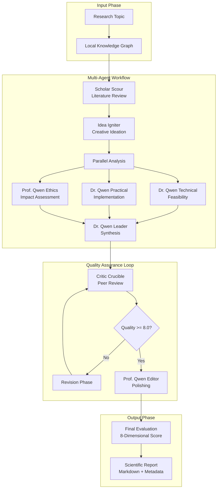

# FIG-MAC: Fine-grained Inspiration Graph Empowered Multi-Agent Collaboration for Automated Scientific Discovery

<div align="center">

[](https://www.python.org/)
[](https://github.com/camel-ai/camel)
[](https://qwenlm.github.io/)
[](LICENSE)

**🤖 Fine-grained Knowledge-driven Multi-Agent System for Automated Scientific Hypothesis Generation**

[🚀 Quick Start](#quick-start) • [📖 Documentation](#documentation) • [🔧 Configuration](#configuration) • [📊 Examples](#examples)

</div>

---

## 📋 Table of Contents

- [Overview](#-overview)
- [Architecture](#-architecture)
- [Features](#-features)
- [Installation](#-installation)
- [Usage](#-usage)
- [Agent Team](#-agent-team)
- [Workflow](#-workflow)
- [Configuration](#-configuration)
- [Project Structure](#-project-structure)
- [Citation](#-citation)
- [License](#-license)

---

## 🎯 Overview

**FIG-MAC** (Fine-grained Inspiration Graph Empowered Multi-Agent Collaboration) is an advanced multi-agent scientific hypothesis generation system that simulates a complete academic research team using AI agents. Built on the [CAMEL](https://github.com/camel-ai/camel) framework, it orchestrates 8 specialized AI agents to collaboratively generate, evaluate, and refine scientific hypotheses through an iterative peer-review process.

The system leverages **Fine-grained Inspiration Graphs (FIG)** to provide structured knowledge from academic literature, enabling agents to generate novel, technically-grounded scientific hypotheses with comprehensive evaluation.

### 🌟 Key Capabilities

- **🔍 Knowledge-Driven Literature Review**: RAG-enhanced retrieval from structured academic knowledge graphs
- **💡 Creative Ideation**: Novel hypothesis generation with cross-domain inspiration from fine-grained knowledge
- **⚖️ Multi-Dimensional Analysis**: Technical, practical, and ethical feasibility assessment
- **🔄 Iterative Refinement**: Quality-driven revision loop with automatic rollback and best-version tracking
- **📊 Comprehensive Evaluation**: 8-dimensional scoring with integrated assessment (25% internal + 75% external)

---

## 🏗️ Architecture



---

## ✨ Features

### 🎭 Multi-Agent Collaboration
| Agent | Role | Expertise |
|-------|------|-----------|
| 📚 **Scholar Scour** | Literature Researcher | Academic paper analysis, knowledge synthesis |
| 💡 **Idea Igniter** | Creative Scientist | Novel hypothesis generation, paradigm innovation |
| 🔧 **Dr. Qwen Technical** | Technical Analyst | Feasibility assessment, algorithm design |
| 🧪 **Dr. Qwen Practical** | Implementation Expert | Resource planning, experimental design |
| ⚖️ **Prof. Qwen Ethics** | Ethics Reviewer | Impact assessment, responsible AI |
| 👨‍🔬 **Dr. Qwen Leader** | Chief Researcher | Hypothesis synthesis, report generation |
| 🔍 **Critic Crucible** | Peer Reviewer | Quality control, constructive critique |
| ✍️ **Prof. Qwen Editor** | Scientific Editor | Publication polishing, clarity enhancement |

### 🔄 Iterative Quality Improvement

```
┌─────────────┐     ┌─────────────┐     ┌─────────────┐
│  Synthesis  │────▶│    Review   │────▶│   Decision  │
└─────────────┘     └─────────────┘     └──────┬──────┘
                                                │
                      ┌─────────────────────────┘
                      │ Yes (Quality >= 8.0)
                      ▼
               ┌─────────────┐
               │   Polish    │────▶ Final Output
               └─────────────┘
                      │
                      │ No (Needs Improvement)
                      ▼
               ┌─────────────┐
               │  Revision   │────▶ Back to Review
               └─────────────┘
```

### 📊 Comprehensive Evaluation System

**8-Dimensional Assessment** (25% Internal + 75% External):
- 🎯 **Clarity** (50% weight): Content comprehensibility
- 🔗 **Relevance** (100%): Topic coverage and significance
- 🏗️ **Structure** (50%): Organization and flow
- ✂️ **Conciseness** (50%): Information density
- 🎯 **Technical Accuracy** (100%): Methodological soundness
- 📖 **Engagement** (100%): Reader captivation
- 💎 **Originality** (100%): Novel contribution
- ⚙️ **Feasibility** (100%): Implementation viability

---

## 🚀 Quick Start

### Prerequisites

- Python 3.10+
- OpenAI-compatible API key (Qwen recommended)
- 16GB+ RAM recommended

### Installation

```bash
# Clone the repository
git clone https://github.com/yourusername/fig-mac.git
cd fig-mac

# Install dependencies
pip install -r requirements.txt

# Set up environment variables
export QWEN_API_KEY="your-api-key-here"
export CAMEL_MODEL_TIMEOUT=1200
export CAMEL_CONTEXT_TOKEN_LIMIT=40000
```

### Basic Usage

```python
from Myexamples.test_mutiagent.hypothesis_society_demo import HypothesisGenerationSociety

# Initialize the society
society = HypothesisGenerationSociety()

# Run research on your topic
result = await society.run_research_async(
    research_topic="How can graph neural networks improve drug discovery?",
    max_iterations=3,
    quality_threshold=8.0,
    polish_iterations=1
)

# Access the generated report
print(f"Report saved to: {result.metadata['file_path']}")
print(f"Final Quality Score: {result.metadata['final_quality_score']}/10")
```

### Command Line Interface

```bash
python -m Myexamples.test_mutiagent.hypothesis_society_demo \
    --topic "Your research topic here" \
    --iterations 3 \
    --threshold 8.0
```

---

## 🔧 Configuration

### Environment Variables

| Variable | Description | Default |
|----------|-------------|---------|
| `QWEN_API_KEY` | API key for Qwen model | Required |
| `QWEN_BASE_URL` | API endpoint URL | https://api.qwen.com |
| `CAMEL_MODEL_TIMEOUT` | Task timeout in seconds | 1200 |
| `CAMEL_CONTEXT_TOKEN_LIMIT` | Max context tokens | 40000 |
| `AGENT_TASK_TIMEOUT` | Agent-specific timeout | None (unlimited) |
| `DISABLE_VECTOR_RETRIEVAL` | Disable vector RAG | false |
| `DISABLE_GRAPH_RETRIEVAL` | Disable graph RAG | false |

### Workflow Configuration

Edit `Myexamples/test_mutiagent/workflow_config.yaml`:

```yaml
iteration:
  max_iterations: 3          # Maximum revision rounds
  quality_threshold: 8.0     # Target quality score (1-10)
  enable_iteration: true     # Enable iterative improvement
  
monitoring:
  track_execution_time: true
  track_token_usage: true
```

---

## 📁 Project Structure

```
fig-mac/
├── 📂 Myexamples/
│   ├── 📂 agents/                    # Agent configurations
│   │   ├── graph_agents/            # Specialized agent configs
│   │   │   ├── critic_crucible.py   # Peer reviewer
│   │   │   ├── qwen_leader.py       # Chief researcher
│   │   │   ├── idea_igniter.py      # Creative scientist
│   │   │   └── ...
│   │   ├── camel_native_agent.py    # Base agent class
│   │   └── final_evaluation_agent.py # 8-dim evaluator
│   │
│   ├── 📂 test_mutiagent/           # Core workflow implementation
│   │   ├── hypothesis_team.py       # Main orchestrator
│   │   ├── hypothesis_society_demo.py # Entry point
│   │   ├── workflow_context_manager.py # Memory management
│   │   ├── workflow_helper.py       # State machine
│   │   └── ...
│   │
│   ├── 📂 data/                     # Knowledge base
│   │   └── final_custom_kg_papers.json
│   │
│   └── 📂 vdb/                      # Vector database
│       └── camel_faiss_storage/
│
├── 📂 Scientific_Hypothesis_Reports/ # Output directory
│   └── *.md                         # Generated reports
│
├── 📂 workflow_outputs/             # Debug artifacts
│
├── 📄 README.md                     # This file
├── 📄 requirements.txt              # Dependencies
├── 📄 QUICKSTART.md                 # Quick start guide
├── 📄 CONTRIBUTING.md               # Contributing guide
└── 📄 LICENSE                       # MIT License
```

---

## 🎓 Agent Team Details

### 1. 📚 Scholar Scour (Literature Review)
- **Function**: Systematic literature review with RAG integration
- **Output**: Theoretical foundations, knowledge gaps, promising directions
- **Tools**: SearchToolkit, Local RAG

### 2. 💡 Idea Igniter (Creative Generation)
- **Function**: Generate 3-5 novel research ideas
- **Output**: Groundbreaking hypotheses with technical specifications
- **Specialty**: Cross-domain innovation, paradigm shifts

### 3. 🔧 Dr. Qwen Technical (Feasibility Analysis)
- **Function**: Technical plausibility assessment
- **Output**: Algorithmic complexity, resource requirements, risk analysis
- **Metrics**: Technical Soundness, Innovation Level

### 4. 🧪 Dr. Qwen Practical (Implementation Planning)
- **Function**: Experimental design and resource planning
- **Output**: Budget estimates, timelines, milestone planning
- **Metrics**: Falsifiability, Experimental Feasibility

### 5. ⚖️ Prof. Qwen Ethics (Impact Assessment)
- **Function**: Societal and ethical implications
- **Output**: Risk-benefit analysis, ethical safeguards
- **Metrics**: Significance Score, Ethical Rating

### 6. 👨‍🔬 Dr. Qwen Leader (Synthesis)
- **Function**: Integrate all inputs into unified hypothesis
- **Output**: Publication-ready scientific report
- **Specialty**: Narrative crafting, technical writing

### 7. 🔍 Critic Crucible (Quality Control)
- **Function**: Peer review with actionable feedback
- **Output**: Quality score (1-10), improvement suggestions
- **Persona**: Senior reviewer for top-tier journals

### 8. ✍️ Prof. Qwen Editor (Polishing)
- **Function**: Language refinement and structure optimization
- **Output**: Publication-quality document
- **Modes**: Content Editor / Language Editor

---

## 🔄 Workflow Process

### Phase 1: Literature Review (RAG-Enhanced)
```
Topic → Vector Retrieval → Graph Retrieval → Knowledge Synthesis
```

### Phase 2: Creative Ideation
```
Literature + RAG → 3-5 Novel Ideas → Technical Specifications
```

### Phase 3: Parallel Analysis
```
Ideas → Technical Analysis
      → Practical Analysis  
      → Ethics Analysis
      (Parallel Execution)
```

### Phase 4: Synthesis
```
All Inputs → Integrated Hypothesis → Scientific Report
```

### Phase 5: Peer Review
```
Report → Quality Score → Decision (Continue/Polish)
```

### Phase 6: Iterative Revision (if needed)
```
Feedback → Substantive Improvements → New Review
```

### Phase 7: Final Polishing
```
Accepted Report → Language Refinement → Final Output
```

### Phase 8: Comprehensive Evaluation
```
Final Report → 8-Dimensional Scoring → Integrated Assessment
```

---

## 📊 Example Output

### Report Metadata
```yaml
**Generated**: 2026-02-05 23:27:03
**Research Topic**: Bridging Towers of Multi-task Learning with Gating Mechanisms
**Processing Pipeline**: Literature → Ideation → Analysis → Synthesis → Review → Revision → Polish
**Iteration Mode**: Enabled (Quality Threshold: 8.0/10)
**Iterations Performed**: 2/3
**Quality Score Progress**: 8.50 → 9.00 → 8.50
**Final Quality Score**: 9.00/10 (from iteration 2)
**Final Rating**: 8.12/10 (25% Internal + 75% External)
```

### 8-Dimensional Evaluation
| Dimension | Score | Weight |
|-----------|-------|--------|
| Clarity | 8.0/10 | 50% |
| Relevance | 9.0/10 | 100% |
| Structure | 9.0/10 | 50% |
| Conciseness | 7.0/10 | 50% |
| Technical Accuracy | 8.0/10 | 100% |
| Engagement | 8.0/10 | 100% |
| Originality | 9.0/10 | 100% |
| Feasibility | 6.0/10 | 100% |

---

## 🔬 Advanced Features

### Context Management
- **3-Layer Memory Architecture**: Short-term / Mid-term / Long-term
- **Intelligent Truncation**: Priority-based content preservation
- **Token Usage Monitoring**: Real-time usage tracking with warnings

### Quality Assurance
- **Regression Detection**: Automatic rollback on quality decrease
- **Best Version Tracking**: Preserve highest-scoring iteration
- **Content Validation**: Ensure technical accuracy and completeness

### RAG Integration
- **Vector Retrieval**: Semantic search from academic papers
- **Graph Retrieval**: Knowledge graph-based inspiration paths
- **Hybrid Strategy**: Combine both for comprehensive grounding

---

## 📝 Citation

If you use FIG-MAC in your research, please cite:

```bibtex
@software{fig_mac,
  title = {FIG-MAC: Fine-grained Inspiration Graph Empowered Multi-Agent Collaboration for Automated Scientific Discovery},
  author = {Your Name},
  year = {2026},
  url = {https://github.com/yourusername/fig-mac}
}
```

---

## 📄 License

This project is licensed under the MIT License - see the [LICENSE](LICENSE) file for details.

---

<div align="center">

**[⬆ Back to Top](#-fig-mac-fine-grained-inspiration-graph-empowered-multi-agent-collaboration-for-automated-scientific-discovery)**

Made with 🔬 and 🤖

</div>
